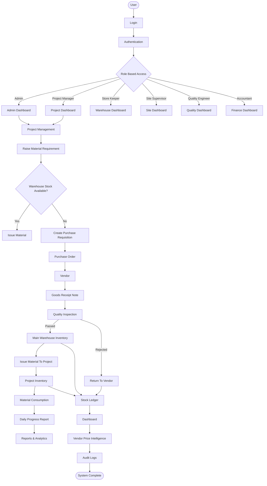

# Sync Inventory ERP - System Overview

This document provides a high-level overview of the Sync Inventory ERP workflow.

## Workflow

1. User logs into the application.
2. Authentication and Role-Based Access Control are verified.
3. Users are redirected to their respective dashboards.
4. Material requirements are created from projects.
5. Warehouse stock is checked.
6. Available stock is issued directly.
7. Unavailable stock generates a Purchase Requisition.
8. Purchase Orders are sent to Vendors.
9. Goods Receipt Notes are created after receiving materials.
10. Quality Inspection is performed.
11. Approved materials are added to the Main Warehouse.
12. Materials are issued to Project Inventory.
13. Site consumption is recorded.
14. Daily Progress Reports are generated.
15. Every inventory movement is recorded in the Stock Ledger.
16. Dashboards and Reports are updated automatically.
17. Audit Logs capture every critical system action.
