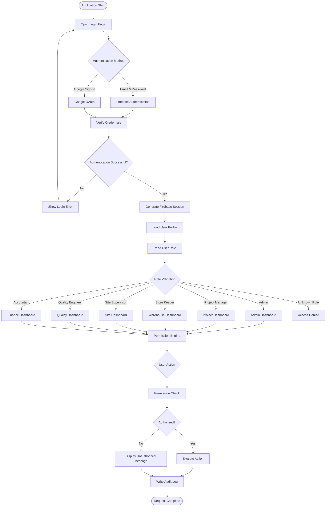

# Authentication & Role-Based Access Control (RBAC)

This document describes the complete authentication flow, authorization process, and role-based access control architecture implemented in the Sync Inventory ERP system.

---

## Authentication & RBAC Workflow

---

# User Roles

| Role                 | Primary Responsibilities                                                                                                                                                           |
| -------------------- | ---------------------------------------------------------------------------------------------------------------------------------------------------------------------------------- |
| **Admin**            | Complete system administration, inventory control, project management, vendor management, user management, reports, system configuration, import/export, audit logs, and security. |
| **Project Manager**  | Manage assigned projects, approve requisitions, create purchase requests, monitor inventory, assign tasks, and review project progress.                                            |
| **Store Keeper**     | Manage warehouse inventory, receive GRNs, issue materials, process stock adjustments, maintain stock ledger, and handle warehouse operations.                                      |
| **Site Supervisor**  | Raise material requirements, receive issued materials, manage site inventory, submit DPRs, and initiate material returns.                                                          |
| **Quality Engineer** | Perform quality inspections, approve or reject received materials, create quality reports, and initiate Return to Vendor (RTV) workflows.                                          |
| **Accountant**       | Monitor project budgets, purchase costs, vendor payments, financial reports, procurement analytics, and spending dashboards.                                                       |

---

# Permission Flow

1. User authenticates using Firebase Authentication.
2. Firebase issues a secure session token.
3. User profile is loaded from Firestore.
4. The assigned role is validated.
5. The Permission Engine checks every protected action.
6. Unauthorized operations are blocked immediately.
7. Every successful or failed operation is recorded in the Audit Log.

---

# Security Features

* Firebase Authentication
* Google OAuth Login
* Role-Based Access Control (RBAC)
* Firestore Security Rules
* Protected Routes
* Secure Session Management
* Permission Validation
* Audit Logging
* Admin-only Critical Operations
* Automatic Unauthorized Access Prevention

---

# Admin-only Operations

Only Administrators can perform the following actions:

* Create or Delete Projects
* Import Projects
* Export Projects
* Reset System Data
* Bulk Delete Records
* Manual Inventory Adjustment
* Direct Stock Entry
* User Management
* Role Assignment
* Vendor Master Management
* Database Cleanup
* System Configuration
* Audit Log Management

---

# Audit Trail

Every authenticated action records:

* User ID
* User Name
* User Role
* Timestamp
* Module
* Action Performed
* Before Value
* After Value
* IP (Optional)
* Status (Success / Failed)

This ensures complete traceability and accountability across the ERP platform.
