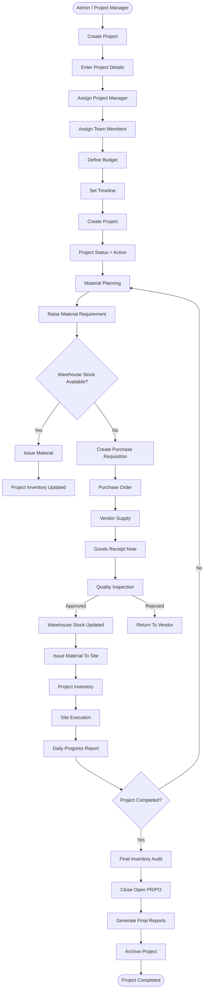

# Project Lifecycle

This document describes the complete lifecycle of a construction project within the Sync Inventory ERP system.

---

## Project Lifecycle Workflow

---

# Project Stages

| Stage | Description |
|---------|-------------|
| Planning | Project created and resources assigned |
| Active | Material procurement and execution started |
| Execution | Daily work, inventory, DPR and tasks |
| Monitoring | Reports, issues and progress tracking |
| Completion | Final audit and reporting |
| Archived | Read-only historical project |

---

# Key Modules Involved

- Projects
- Users
- Material Requirement
- Purchase Requisition
- Purchase Order
- Goods Receipt Note
- Warehouse
- Project Inventory
- Daily Progress Report
- Reports
- Audit Logs

---

# Business Rules

- Every project must have one Project Manager.
- Budget must be defined before procurement.
- Material Requirements must belong to a project.
- Inventory movements must always reference a project.
- DPRs can only be submitted for Active projects.
- Completed projects become read-only.
- Archived projects cannot receive new inventory transactions.

---

# Firestore Collections

- projects
- users
- materialRequirements
- purchaseRequisitions
- purchaseOrders
- goodsReceipts
- inventory
- stockMovements
- dailyReports
- auditLogs
