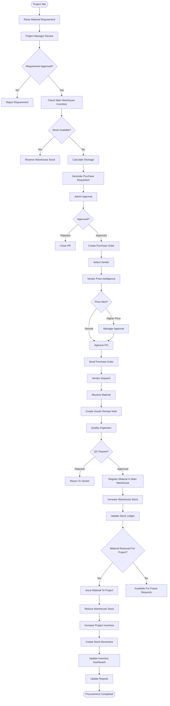

# Procurement Workflow

This document describes the complete procurement lifecycle from Material Requirement to Goods Receipt, Warehouse Stock Update, Site Issue, and Price Intelligence.

---

## Procurement Workflow

---

# Procurement Stages

| Stage | Description |
|--------|-------------|
| Material Requirement | Site raises material demand |
| Warehouse Check | Check stock availability |
| Purchase Requisition | Auto-create for shortages |
| Approval | Manager/Admin approval |
| Purchase Order | Vendor order creation |
| Vendor Supply | Vendor dispatches materials |
| GRN | Material received |
| QC | Quality inspection |
| Warehouse | Main Warehouse registration |
| Site Issue | Material transferred to project |
| Inventory | Warehouse & Project inventory updated |
| Reporting | Dashboard & reports refreshed |

---

# Business Rules

- Main Warehouse must always be checked first.
- Purchase Requisition is generated only for shortages.
- If Warehouse has 4 units and Project needs 5, only 1 unit should be procured.
- Every vendor delivery must first be registered in Main Warehouse, even if physically delivered directly to the site.
- Warehouse becomes the single source of truth.
- Every movement must create a Stock Ledger entry.
- Approved GRNs update inventory automatically.
- Vendor Price Intelligence is updated after every Approved GRN.

---

# Firestore Collections

- materialRequirements
- purchaseRequisitions
- purchaseOrders
- goodsReceipts
- inventory
- projectInventory
- stockMovements
- materialPriceHistory
- vendorPriceAnalytics
- auditLogs
