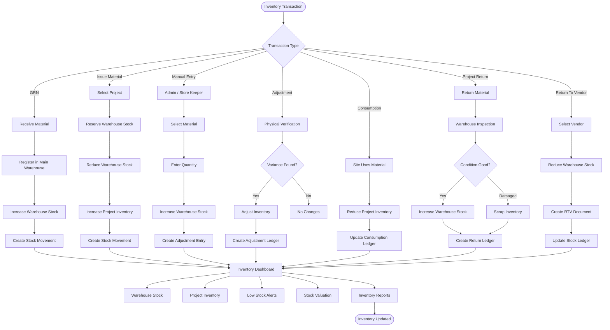

# Inventory Workflow

This document describes the complete inventory lifecycle within the Sync Inventory ERP system, covering warehouse management, stock movements, project inventory, manual adjustments, returns, and inventory reconciliation.

---

## Inventory Workflow

---

# Inventory Components

| Module | Description |
|----------|-------------|
| Main Warehouse | Central inventory repository |
| Project Inventory | Site-specific inventory |
| Stock Movement | Complete inventory audit trail |
| Manual Stock Entry | Direct inventory addition |
| Stock Adjustment | Physical stock correction |
| Material Consumption | Site material usage |
| Return Management | Warehouse and Vendor returns |
| Dashboard | Live inventory analytics |

---

# Business Rules

- Every incoming material must first be registered in the Main Warehouse.
- Every issue reduces Warehouse stock and increases Project Inventory.
- Manual Stock Entry is restricted to Admin and Store Keeper.
- Every inventory transaction must generate a Stock Movement record.
- Negative stock is not allowed.
- Inventory adjustments require remarks.
- Project Inventory cannot exceed issued quantity.
- Returns automatically update warehouse stock after approval.
- Inventory Dashboard always reflects live Firestore data.

---

# Firestore Collections

- inventory
- warehouseInventory
- projectInventory
- stockMovements
- returns
- returnsToVendor
- goodsReceipts
- stockAdjustments
- auditLogs

---

# Inventory Lifecycle

1. Material Received (GRN)
2. Main Warehouse Registration
3. Stock Ledger Update
4. Material Issued to Project
5. Project Inventory Updated
6. Material Consumed
7. Material Returned (Optional)
8. Warehouse Updated
9. Dashboard Refreshed
10. Reports Generated
