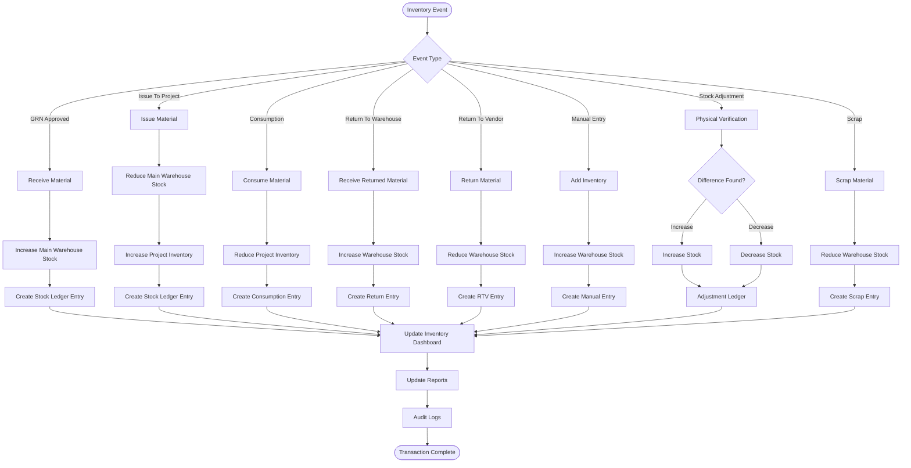

# Stock Ledger Workflow

This document describes the complete Stock Ledger architecture of the Sync Inventory ERP system.

The Stock Ledger acts as the immutable audit trail for every inventory transaction occurring within the application.

---

## Stock Ledger Workflow

---

# Ledger Transaction Types

| Transaction | Description |
|--------------|-------------|
| STOCK_IN | Material received into warehouse |
| STOCK_OUT | Material issued from warehouse |
| PROJECT_ISSUE | Warehouse to Project transfer |
| PROJECT_RETURN | Project to Warehouse return |
| RTV | Return to Vendor |
| CONSUMPTION | Material consumed at site |
| MANUAL_ENTRY | Direct inventory addition |
| ADJUSTMENT | Physical stock correction |
| SCRAP | Damaged or unusable material |
| TRANSFER | Warehouse to Warehouse transfer |

---

# Stock Ledger Record Structure

Each ledger entry stores:

- Transaction ID
- Material ID
- Material Name
- SKU
- Warehouse
- Project
- Vendor
- Quantity
- Previous Stock
- New Stock
- Unit Price
- Total Value
- Transaction Type
- Reference Number (GRN / PR / PO / RTV)
- User
- Remarks
- Timestamp

---

# Business Rules

- Every inventory movement must generate a Stock Ledger entry.
- Stock Ledger records are immutable and cannot be edited.
- Ledger entries must always include the previous and new stock quantities.
- Every transaction must reference its source document (GRN, PO, PR, RTV, etc.).
- Negative stock balances are not allowed.
- Every transaction is automatically recorded in the Audit Log.
- Dashboard and Reports are updated immediately after ledger creation.

---

# Firestore Collections

- stockMovements
- inventory
- warehouseInventory
- projectInventory
- goodsReceipts
- purchaseOrders
- purchaseRequisitions
- returns
- returnsToVendor
- auditLogs

---

# Stock Movement Lifecycle

1. Inventory Event Occurs
2. Validate Transaction
3. Update Inventory
4. Create Stock Ledger Entry
5. Update Dashboard
6. Generate Reports
7. Record Audit Log
8. Transaction Completed

---

# Benefits

- Complete inventory traceability
- Real-time stock visibility
- Immutable audit trail
- Financial reconciliation support
- Compliance and audit readiness
- Accurate inventory history
- Enterprise-grade inventory management
