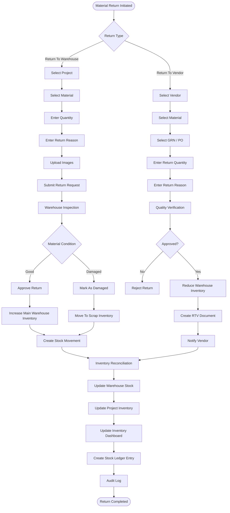

# Return Management Workflow

This document describes the complete Return Management workflow within the Sync Inventory ERP system.

It covers:

- Return to Warehouse (RTW)
- Return to Vendor (RTV)
- Inspection
- Approval
- Stock Updates
- Inventory Reconciliation
- Audit Logging

---

## Return Management Workflow

---

# Return Types

| Return Type | Description |
|-------------|-------------|
| Return To Warehouse | Unused materials returned from project site |
| Return To Vendor | Defective or rejected materials returned to supplier |

---

# Business Rules

- Every return request must belong to a Project.
- Every return must reference a Material.
- Warehouse inspection is mandatory before stock updates.
- Good materials increase Main Warehouse Inventory.
- Damaged materials move to Scrap Inventory.
- RTV must reference the original Purchase Order or GRN.
- Every approved return creates a Stock Ledger entry.
- Inventory Dashboard updates automatically.
- Audit Logs record every approval and rejection.

---

# Approval Workflow

Return Request

↓

Warehouse Inspection

↓

Condition Verification

↓

Approval / Rejection

↓

Inventory Update

↓

Stock Ledger

↓

Dashboard Refresh

↓

Audit Log

---

# Firestore Collections

- returns
- returnItems
- returnsToVendor
- warehouseInventory
- projectInventory
- stockMovements
- goodsReceipts
- purchaseOrders
- inventory
- auditLogs

---

# Inventory Impact

## Return To Warehouse

- Increase Main Warehouse Stock
- Reduce Project Inventory
- Update Stock Ledger
- Update Dashboard

## Return To Vendor

- Reduce Warehouse Stock
- Create RTV Document
- Notify Vendor
- Update Dashboard
- Update Stock Ledger

---

# Security

Only authorized users can perform return operations.

| Role | Permission |
|------|------------|
| Admin | Full Access |
| Store Keeper | Approve Warehouse Returns |
| Project Manager | Create Return Requests |
| Site Supervisor | Initiate Return Requests |
| Quality Engineer | Approve / Reject RTV |
| Accountant | View Financial Impact |

---

# Benefits

- Complete return traceability
- Inventory reconciliation
- Vendor accountability
- Warehouse accuracy
- Financial transparency
- Enterprise audit compliance
