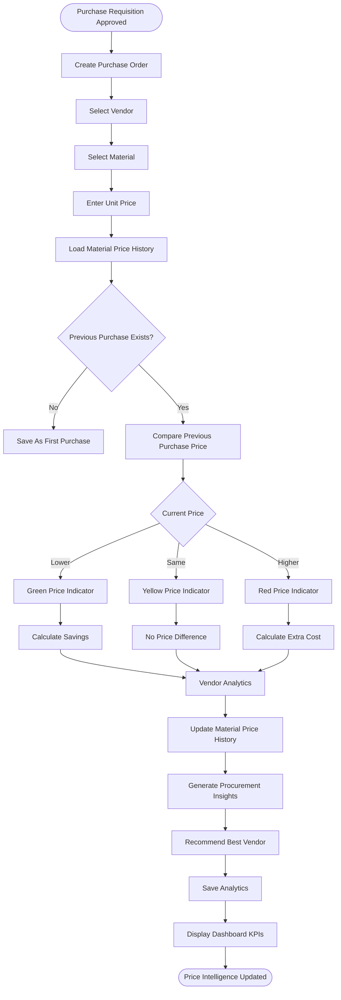
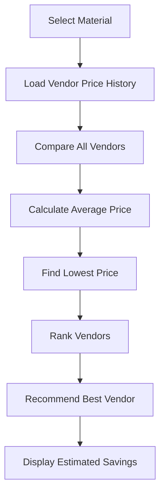

# Vendor Price Intelligence

This document describes the Vendor Price Intelligence Engine implemented in the Sync Inventory ERP system.

The objective of this module is to help procurement teams purchase materials at the most competitive price by maintaining historical pricing, vendor comparisons, and procurement analytics.

---

## Vendor Price Intelligence Workflow

---

# Vendor Price History

Every approved purchase creates a permanent historical record.

Each record stores:

- Material ID
- Material Name
- SKU
- Vendor ID
- Vendor Name
- Purchase Order
- GRN
- Unit Price
- Quantity
- Total Cost
- Purchase Date
- Project
- User
- Timestamp

Historical records are never overwritten.

---

# Price Comparison Logic

Whenever a Purchase Order is created, the system automatically compares:

Current Purchase Price

↓

Previous Purchase Price

↓

Difference

↓

Percentage Difference

↓

Price Indicator

---

## Price Indicators

| Indicator | Meaning |
|-----------|---------|
| 🟢 Green | Current purchase is cheaper than previous purchase |
| 🟡 Yellow | Price difference is within acceptable tolerance |
| 🔴 Red | Current purchase is more expensive than previous purchase |

---

# Procurement Intelligence

The system automatically calculates:

- Previous Purchase Price
- Current Purchase Price
- Price Difference
- Percentage Change
- Savings
- Additional Cost
- Vendor Performance
- Purchase Frequency
- Average Material Cost

---

# Vendor Recommendation Workflow

---

# Dashboard KPIs

The Vendor Intelligence Dashboard displays:

- Lowest Purchase Price
- Highest Purchase Price
- Average Purchase Price
- Current Purchase Price
- Total Savings
- Extra Procurement Cost
- Best Vendor
- Worst Vendor
- Price Inflation
- Purchase Trend
- Vendor Ranking

---

# Business Rules

- Price History is created only after an Approved GRN.
- Historical records cannot be modified.
- Vendor comparison uses only approved purchases.
- Price calculations always use live Firestore data.
- Every purchase updates procurement analytics.
- Every price comparison is logged in the Audit Log.
- Procurement recommendations are generated automatically.

---

# Firestore Collections

- materialPriceHistory
- vendorPriceAnalytics
- purchaseOrders
- goodsReceipts
- vendors
- inventory
- auditLogs

---

# Benefits

- Historical price tracking
- Vendor comparison
- Procurement optimization
- Cost reduction
- Better purchasing decisions
- Enterprise procurement analytics
- Complete audit trail
- Automatic vendor recommendations
- Price trend analysis
- Budget control
