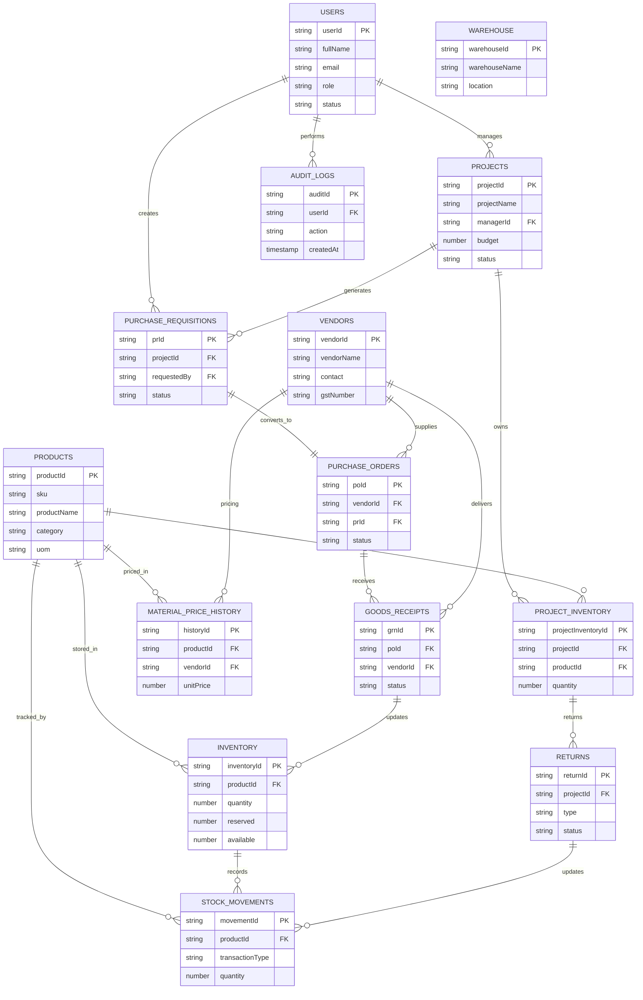

# Firestore Database Architecture

This document describes the Firestore database architecture of the Sync Inventory ERP system.

The database is designed around a centralized inventory model where the Main Warehouse acts as the single source of truth and every transaction is recorded for complete traceability.

---

## Firestore Entity Relationship Diagram (ERD)

---

# Primary Firestore Collections

| Collection | Purpose |
|------------|---------|
| users | User Accounts |
| projects | Project Master |
| products | Product Catalog |
| vendors | Vendor Master |
| inventory | Main Warehouse Inventory |
| projectInventory | Site Inventory |
| purchaseRequisitions | Material Requests |
| purchaseOrders | Vendor Orders |
| goodsReceipts | GRN Records |
| returns | Return Management |
| stockMovements | Inventory Ledger |
| materialPriceHistory | Price Intelligence |
| auditLogs | System Audit |

---

# Design Principles

- Firestore Document IDs are used internally.
- Human-readable names are displayed in the UI.
- Main Warehouse is the single source of truth.
- Every inventory movement creates a Stock Movement record.
- Every purchase updates Material Price History.
- Every action is recorded in Audit Logs.
- All relationships are maintained through document references.

---

# Architecture Highlights

✅ Centralized Warehouse Model

✅ Project-wise Inventory Tracking

✅ Complete Procurement Workflow

✅ Vendor Price Intelligence

✅ Immutable Stock Ledger

✅ Role-Based Access Control (RBAC)

✅ Audit Logging

✅ Real-time Firestore Synchronization
