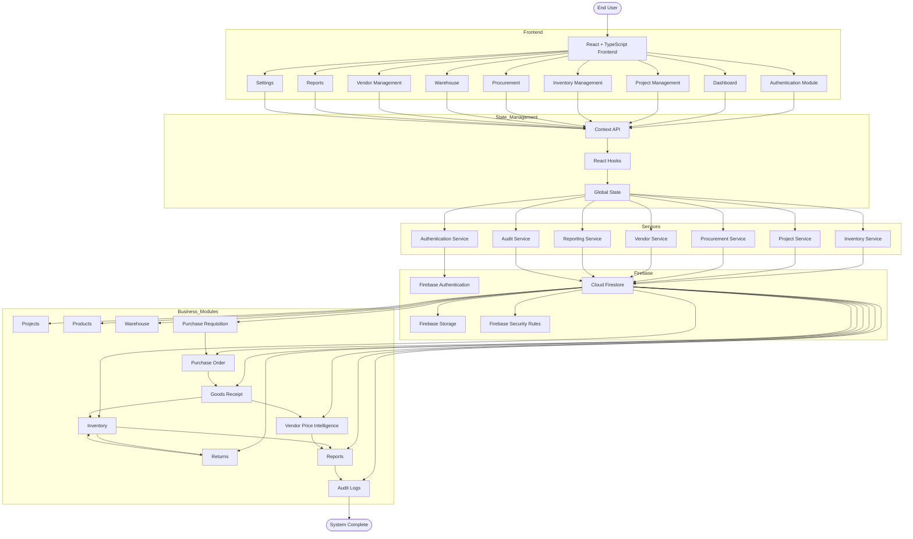

# Application Architecture

This document describes the overall software architecture of the **Sync Inventory ERP System**. It illustrates how the frontend, backend, services, Firebase, Firestore, and business modules interact to deliver a real-time inventory and procurement management platform.

---

## Application Architecture

---

# Technology Stack

| Layer | Technology |
|--------|------------|
| Frontend | React + TypeScript |
| Styling | Tailwind CSS |
| Routing | React Router |
| State Management | Context API |
| Authentication | Firebase Authentication |
| Database | Cloud Firestore |
| Storage | Firebase Storage |
| Security | Firestore Rules |
| Hosting | Firebase Hosting / Google Cloud |

---

# Core Modules

- Authentication
- Dashboard
- Projects
- Inventory
- Main Warehouse
- Project Inventory
- Purchase Requisition
- Purchase Order
- Goods Receipt Note (GRN)
- Returns Management
- Vendor Management
- Vendor Price Intelligence
- Reports & Analytics
- Audit Logs

---

# Architectural Principles

- Modular Architecture
- Component-Based Design
- Service Layer Abstraction
- Centralized State Management
- Real-time Firestore Synchronization
- Single Source of Truth (Main Warehouse)
- Immutable Stock Ledger
- Role-Based Access Control (RBAC)
- Enterprise-grade Audit Logging

---

# Data Flow

1. User performs an action through the React UI.
2. The request is processed by the appropriate Service Layer.
3. Firebase Authentication validates the user.
4. Firestore Security Rules verify permissions.
5. Firestore performs the database operation.
6. Business Modules update related collections.
7. Inventory and Reports refresh automatically.
8. Audit Logs capture every important transaction.

---

# Benefits

- Scalable architecture
- Real-time synchronization
- Secure authentication
- Modular services
- Easy maintenance
- High performance
- Enterprise-ready design
- Cloud-native deployment
