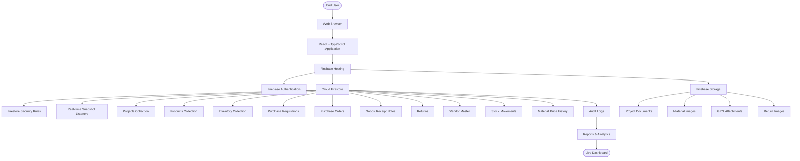

# Deployment Architecture

This document describes the deployment architecture of the **Sync Inventory ERP System**.

The application is designed as a cloud-native solution using Firebase services with a React + TypeScript frontend.

---

## Deployment Architecture

---

# Deployment Components

| Component | Technology |
|------------|------------|
| Frontend | React + TypeScript |
| UI | Tailwind CSS |
| Authentication | Firebase Authentication |
| Database | Cloud Firestore |
| File Storage | Firebase Storage |
| Hosting | Firebase Hosting |
| Security | Firestore Rules |
| Real-time Updates | Firestore Snapshot Listeners |

---

# Production Flow

1. User opens the application.
2. React application loads from Firebase Hosting.
3. User authenticates using Firebase Authentication.
4. Firestore Security Rules validate permissions.
5. Business data is loaded from Cloud Firestore.
6. Real-time listeners keep the UI synchronized.
7. Uploaded documents and images are stored in Firebase Storage.
8. Reports and dashboards update automatically without page refresh.

---

# Deployment Principles

- Cloud-native architecture
- Fully serverless deployment
- Real-time synchronization
- Secure authentication
- Role-Based Access Control (RBAC)
- Firestore as the single source of truth
- Scalable and highly available infrastructure

---

# Firebase Services Used

- Firebase Authentication
- Cloud Firestore
- Firebase Storage
- Firebase Hosting
- Firestore Security Rules

---

# Security Layer

Every request follows this sequence:

User Request

↓

Firebase Authentication

↓

Firestore Security Rules

↓

Cloud Firestore

↓

Application Response

---

# High-Level Deployment Benefits

- No dedicated backend server required
- Automatic scaling through Firebase
- Secure authentication and authorization
- Real-time inventory updates
- Fast global content delivery
- Minimal infrastructure maintenance
- Enterprise-ready cloud deployment

---

# Future Enhancements

- Cloud Functions for server-side automation
- Scheduled background jobs
- Email and Push Notifications
- Backup & Restore automation
- Multi-region deployment
- CI/CD pipeline with GitHub Actions
- Performance monitoring with Firebase Analytics
