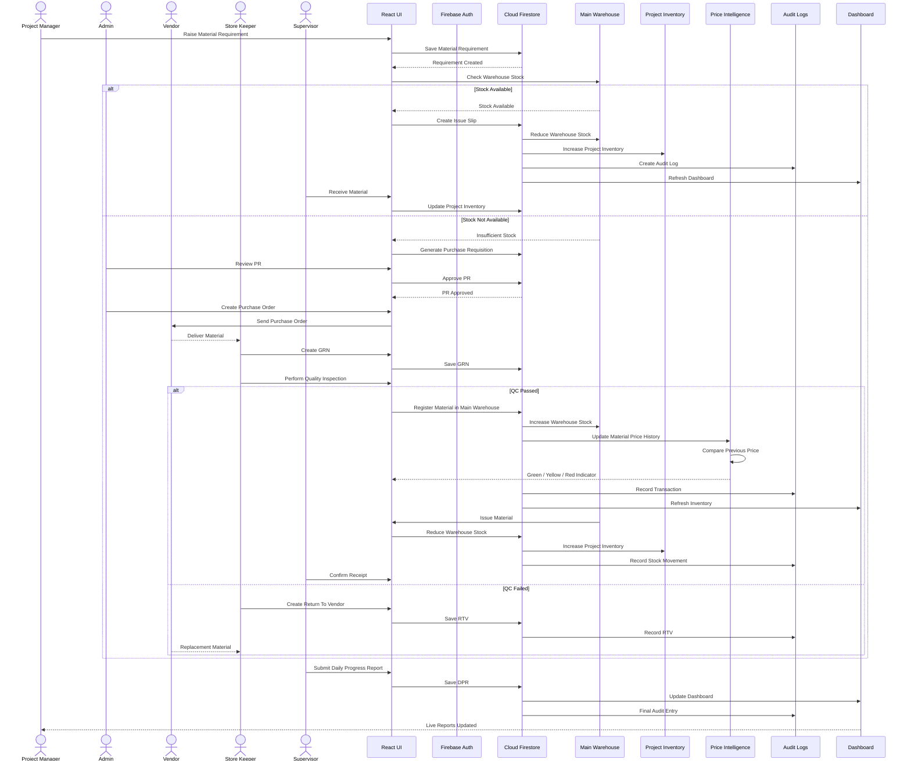

# Complete System Sequence Diagram

This document describes the end-to-end sequence of a material procurement and inventory transaction in the Sync Inventory ERP System.

---

## End-to-End System Sequence

---

# Sequence Summary

1. Project Manager raises a Material Requirement.
2. Main Warehouse inventory is checked.
3. If stock is available, it is issued directly.
4. If stock is unavailable, a Purchase Requisition is generated.
5. Admin reviews and approves the Purchase Requisition.
6. Purchase Order is created and sent to the Vendor.
7. Vendor delivers materials.
8. Store Keeper creates the Goods Receipt Note (GRN).
9. Quality Inspection is performed.
10. Approved materials are registered in the Main Warehouse.
11. Material Price Intelligence updates automatically.
12. Required materials are issued to the Project.
13. Project Inventory is updated.
14. Stock Ledger and Audit Logs are created.
15. Supervisor submits the Daily Progress Report.
16. Dashboard and Analytics refresh in real time.

---

# Systems Involved

- React Frontend
- Firebase Authentication
- Cloud Firestore
- Main Warehouse
- Project Inventory
- Vendor Price Intelligence
- Audit Logs
- Dashboard & Analytics

---

# Key Business Rules

- Main Warehouse is always checked before procurement.
- Every vendor delivery is first registered in the Main Warehouse.
- Every inventory movement creates a Stock Ledger entry.
- Every important action creates an Audit Log.
- Dashboard updates automatically using Firestore real-time listeners.
